# Video Upscaling – FFmpeg + Upscayl

A frame-by-frame video upscaling pipeline using FFmpeg for frame extraction and reassembly, and Upscayl with the `realesr-animevideov3-x4` model for AI-based resolution upscaling. The goal is to increase the resolution of animation and stylized content while maintaining the source's visual identity — linework, color palette, and stylization — without introducing artifacts or altering the art style.

> **Intended media:** Animation and stylized/illustrated content. The `realesr-animevideov3-x4` model is specifically trained on animated video frames. Results on live-action or photographic content will differ.

---

## Table of Contents

- [Purpose & Intent](#purpose--intent)
- [How It Works](#how-it-works)
- [Demonstration](#demonstration)
- [Upscaling Alone vs. Signal Processing + Regeneration](#upscaling-alone-vs-signal-processing--regeneration)
- [Model Comparison](#model-comparison)
- [Requirements](#requirements)
- [Pipeline](#pipeline)
  - [Step 1 — Pre-Check: CFR vs VFR](#step-1--pre-check-cfr-vs-vfr)
  - [Step 2 — Frame Extraction](#step-2--frame-extraction)
  - [Step 3 — Upscale](#step-3--upscale)
  - [Step 4 — Reassemble](#step-4--reassemble)
- [x265 Encoding Parameters](#x265-encoding-parameters)
- [CFR vs VFR Reference](#cfr-vs-vfr-reference)
- [Credits & Citations](#credits--citations)

---

## Purpose & Intent

This pipeline is for **resolution upscaling** — taking a video that is low resolution and producing a higher resolution version. It does not restore detail destroyed by compression, and it does not regenerate missing information. What it does is scale up existing pixels using a model trained to understand the structural patterns of animated content, producing a sharper, cleaner result than bicubic or Lanczos interpolation.

The frame-by-frame approach (extract all frames → upscale each independently → reassemble) is used rather than video-level upscaling because it gives the AI model clean, individual images to work with rather than a compressed video stream — and it preserves exact frame timing through the pipeline.

**What this is:**
- Resolution upscaling: small → large
- Stylization-preserving: `realesr-animevideov3-x4` is designed to maintain cel-shaded and illustrated aesthetics
- Lossless intermediate: frames are stored as PNG through the upscale step

**What this is not:**
- A restoration or denoising tool (see the [ComfyUI Flux Regen workflow](https://github.com/komo-248/ComfyUI-Flux-Regenerative-Upscale) for that)
- Capable of recovering detail destroyed by compression

---

## How It Works

1. Source video is probed with `ffprobe` to determine frame rate type (CFR vs VFR)
2. FFmpeg extracts every frame as a lossless PNG
3. Upscayl processes the frame folder in batch, upscaling each PNG 4x with `realesr-animevideov3-x4`
4. FFmpeg reassembles the upscaled frames with the original audio into an x265 encode

The audio is kept separate throughout and muxed in at the end with no re-encoding, preserving original quality.

---

## Demonstration

> **Copyright disclaimer:** The footage used in this demonstration is from *Hajime no Ippo* and is the property of George Morikawa, Kodansha, and their respective rights holders. It is used here solely for technical evaluation purposes — to demonstrate the restoration capabilities of this workflow on real-world compressed animation sources. No copyright infringement is intended. If you are a rights holder and would like this removed, please open an issue.


https://github.com/user-attachments/assets/2666b046-472c-44b0-a808-cc66e3b326b2


> **Note:** Frame-by-frame processing means frames can be cut or reordered for consistency, so the output will not align one-to-one with the source. This is an expected characteristic of the pipeline and is why the demonstration video does not match the original frame for frame.

<p align="center"><em>Left: source frame &nbsp;|&nbsp; Right: upscaled output</em></p>

<p align="center">
  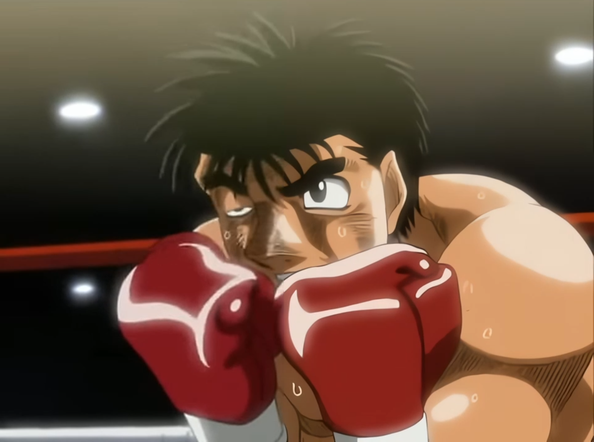
  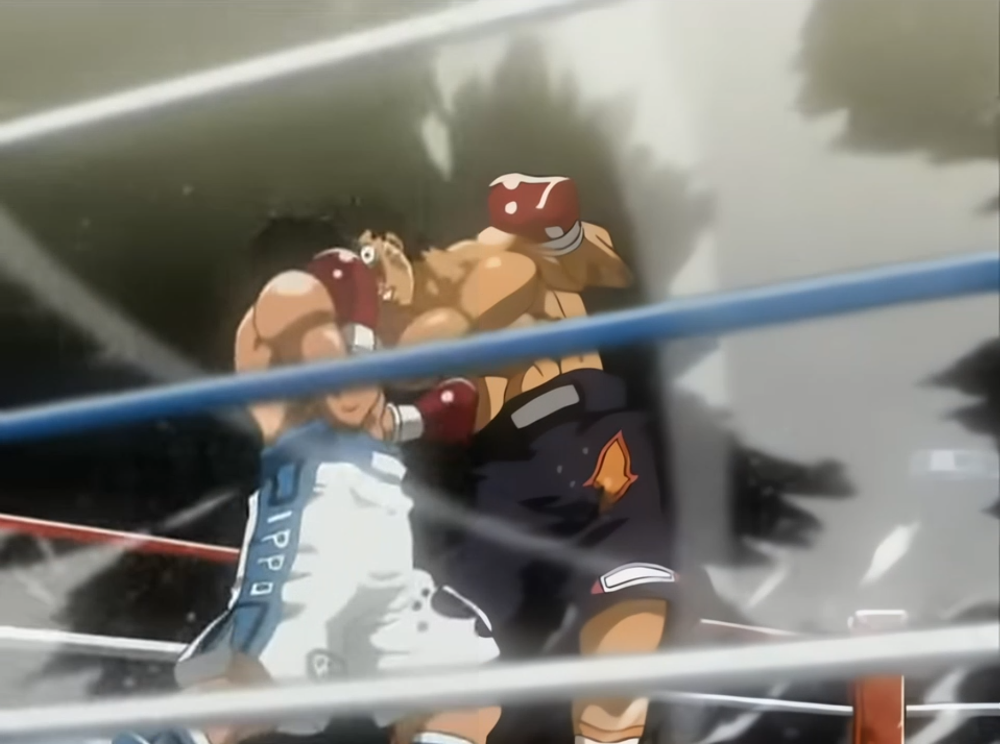
</p>
<p align="center">
  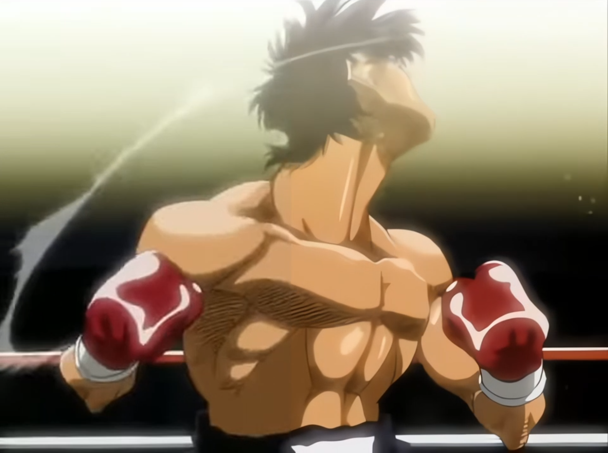
  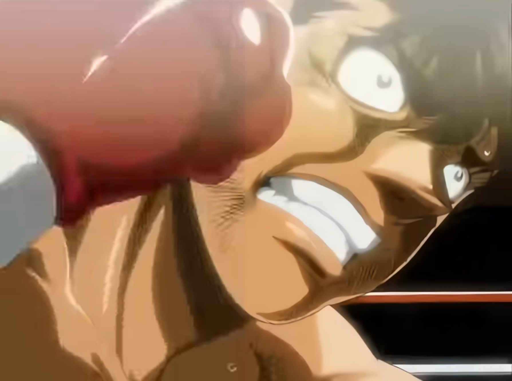
</p>
<p align="center">
  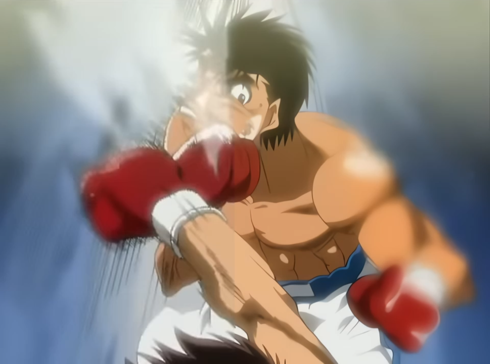
  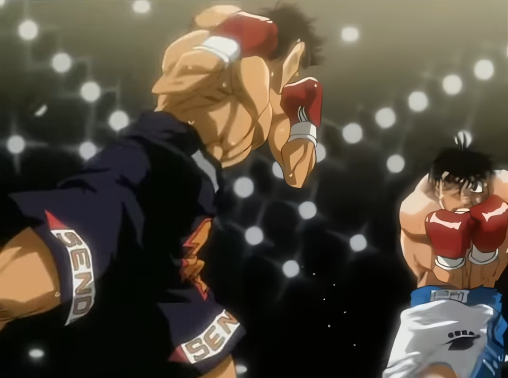
</p>
<p align="center">
  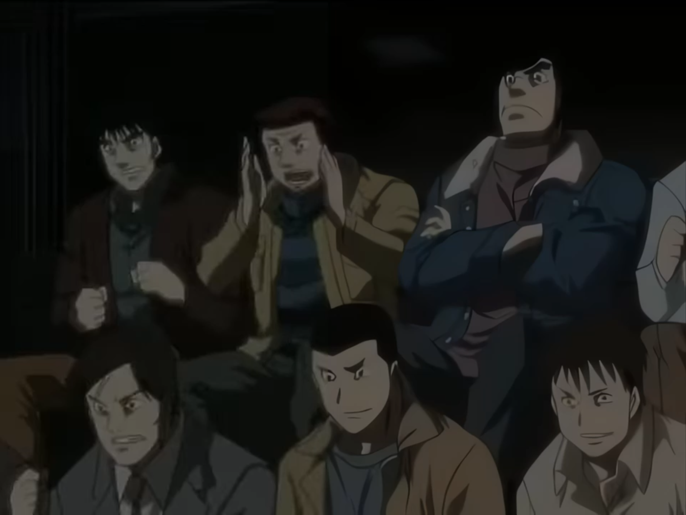
  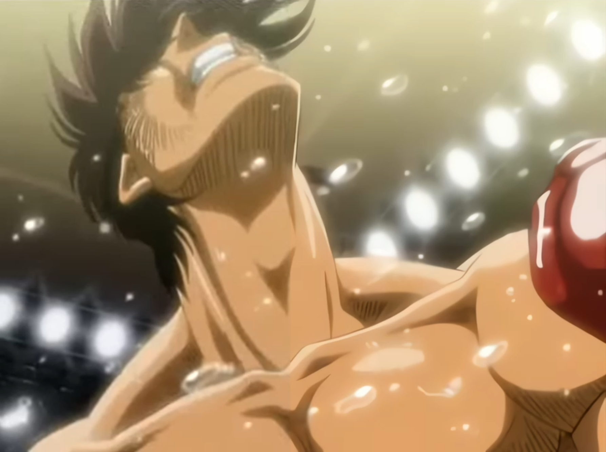
</p>
<p align="center">
  
  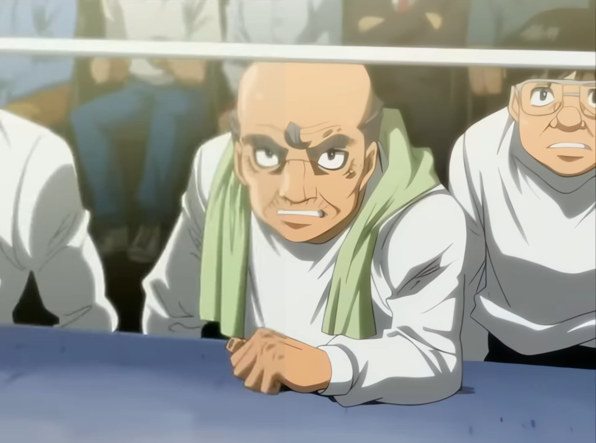
</p>
<p align="center">
  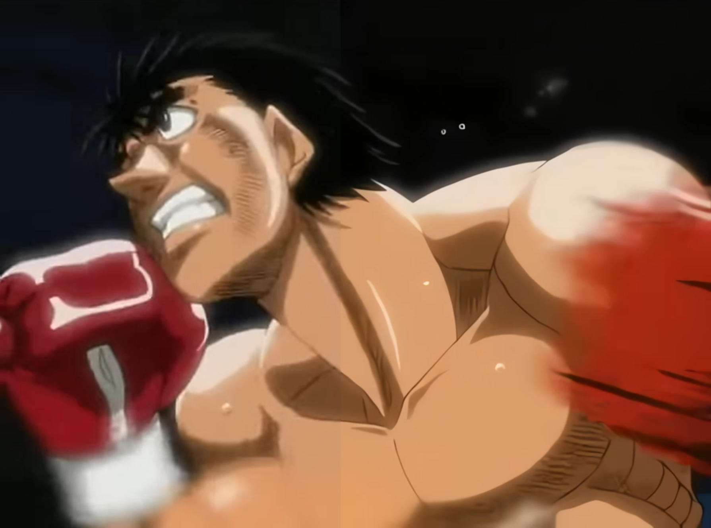
  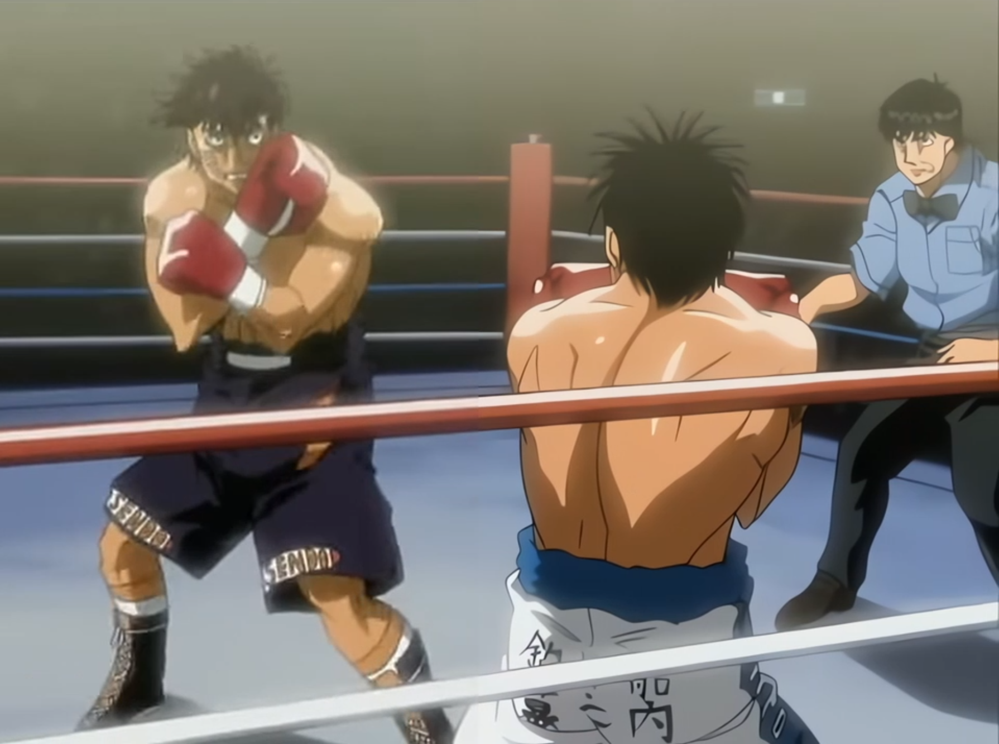
</p>

---

## Upscaling Alone vs. Signal Processing + Regeneration

This pipeline — Real-ESRGAN upscaling via Upscayl — represents the practical baseline for animation upscaling. It is fast, accessible, requires no model setup beyond a desktop app, and produces genuinely good results on clean or lightly compressed sources. For many use cases, it is sufficient.

However, upscaling and restoration are fundamentally different problems, and a pure upscaler has a hard ceiling on what it can do.

### What an upscaler can and cannot do

Real-ESRGAN and similar models are trained to map low-resolution pixels to plausible high-resolution outputs. They do this well when the input is clean — the model has learned the structural patterns of animation and can reliably extrapolate sharper edges and finer detail from a low-res source.

The problem is compression. JPEG blocking, video macroblocking, and ringing artifacts are not low-resolution versions of the original signal — they are corruptions that have replaced the original signal entirely. The upscaler has no way to distinguish between "this flat region is flat because the art is flat" and "this flat region is flat because compression destroyed the gradient that was there." It can only upscale what it sees. Feeding it a compressed frame produces a larger version of a compressed frame — the blocking gets sharper, the ringing gets crisper, and any detail that was destroyed stays destroyed.

### What the ComfyUI workflow adds

The [Flux Regenerative Upscale workflow](https://github.com/komo-248/ComfyUI-Flux-Regenerative-Upscale) was built to address this directly. Rather than upscaling the degraded input, it first analyzes each frame with a stack of signal processing tools to identify exactly where compression damage is present — then uses a diffusion inpainting model (FLUX.1-fill-dev) to regenerate those regions from scratch, guided by the frame's intact structural information (lineart, edges). The upscaler then operates on a frame that has already had its compression artifacts removed and its lost detail reconstructed.

The difference in outcome is most visible on heavily compressed sources — older DVD encodes, low-bitrate streams, anything that has been re-encoded multiple times. On these sources, the upscaler-only output will faithfully reproduce every compression artifact at 4x size. The regenerative workflow will reconstruct what the frame likely looked like before the damage.

### Practical tradeoffs

| | FFmpeg + Upscayl | ComfyUI Flux Regen |
|--|------------------|--------------------|
| **Setup** | Simple — desktop app | Complex — ComfyUI, 7 custom node packs, 7 model downloads |
| **Hardware** | Any modern GPU | ~24GB VRAM (fp32); 16GB with fp8 quantization |
| **Speed** | Fast | Slow — diffusion inference per frame |
| **Best on** | Clean or lightly compressed sources | Heavily compressed, degraded, or artifact-heavy sources |
| **Compression artifacts** | Upscaled alongside content | Identified and regenerated by diffusion model |
| **Output character** | Faithful to source | Reconstructed — closer to pre-compression original |
| **Temporal consistency** | High — frame-independent upscaler is stable | High — ControlNet lineart guidance enforces consistency |

### Which to use

Use this pipeline (FFmpeg + Upscayl) when the source is reasonably clean and the goal is simply higher resolution. It is fast, produces consistent results, and requires no specialized hardware beyond a gaming GPU.

Use the [ComfyUI Flux Regen workflow](https://github.com/komo-248/ComfyUI-Flux-Regenerative-Upscale) when the source is heavily compressed, artifact-ridden, or has visibly degraded linework and detail. The additional complexity and compute cost is justified when the source material genuinely has information that needs to be reconstructed rather than just scaled.

For archival-quality work on damaged sources, the regenerative approach is not just better — it is the only approach that actually addresses the underlying problem.

---

## Model Comparison

Three Upscayl models were evaluated for animated content:

| Model | Intended Use | Result on Animation |
|-------|-------------|-------------------|
| **`realesr-animevideov3-x4`** ✓ | Animated video frames | Best temporal consistency across frames, sharpest linework, minimal inter-frame flickering. Specifically trained on video frames rather than static images. |
| `Upscayl Digital Art` | Illustrations, static art | Oversaturates colors and produces haloing artifacts on video frames. Better suited to single images. |
| `waifu2x` | Clean line art, illustrations | Performs well on static frames but produces visible flickering artifacts on motion frames due to lack of temporal training. |

**`realesr-animevideov3-x4` was used for this pipeline** based on these results. The video-specific training makes a significant difference in temporal stability — flickering is the primary failure mode of using still-image models on video.

---

## Requirements

| Tool | Purpose | Install |
|------|---------|---------|
| [FFmpeg](https://ffmpeg.org/download.html) | Frame extraction and reassembly | System install |
| [Upscayl](https://upscayl.org/) | AI frame upscaling | Desktop app |
| GPU | Required for Upscayl | dGPU strongly recommended |

---

## Pipeline

### Step 1 — Pre-Check: CFR vs VFR

Before extracting frames, determine whether the source video uses a **Constant Frame Rate (CFR)** or **Variable Frame Rate (VFR)**. Using the wrong extraction mode causes frame timing errors — frames reassemble at the wrong timestamps and the output video plays back incorrectly.

```bash
ffprobe -v error -select_streams v:0 \
  -show_entries stream=r_frame_rate,avg_frame_rate \
  -of default=noprint_wrappers=1 input.mkv
```

**Reading the output:**

| Result | Type |
|--------|------|
| `r_frame_rate == avg_frame_rate` | CFR → use CFR path |
| `r_frame_rate != avg_frame_rate` | VFR → use VFR path |

Example — CFR:
```
r_frame_rate=24000/1001
avg_frame_rate=24000/1001
```

Example — VFR:
```
r_frame_rate=60/1
avg_frame_rate=2997/100
```

> Note the exact `r_frame_rate` value — it is used in Steps 2 and 4.

---

### Step 2 — Frame Extraction

Create output folders:
```bash
mkdir frames
mkdir frames_upscaled
```

**CFR:**
```bash
ffmpeg -i input.mkv -c:v png -fps_mode cfr -r <r_frame_rate> frames/%08d.png
```

**VFR:**
```bash
ffmpeg -i input.mkv -c:v png -fps_mode vfr frames/%08d.png
```

The `%08d` zero-pads filenames to 8 digits, ensuring correct sort order on reassembly. PNG is lossless — no quality is lost in the intermediate step.

> Disk space: at 1080p, each PNG frame is roughly 2–4MB. A 24fps 1-hour video produces ~86,400 frames (~200–350GB). Plan storage accordingly.

---

### Step 3 — Upscale

Open Upscayl and configure:

| Setting | Value |
|---------|-------|
| Input folder | `frames/` |
| Output folder | `frames_upscaled/` |
| Model | `realesr-animevideov3-x4` |
| Scale | 4x |
| Mode | Batch |
| Output format | PNG |
| GPU | Select GPU **1** (dGPU) |

> If you have both integrated and discrete graphics, make sure GPU **1** (the dGPU) is selected. The iGPU (GPU 0) will be significantly slower and may run out of memory on large frames.

---

### Step 4 — Reassemble

**CFR:**
```bash
ffmpeg \
  -framerate <r_frame_rate> \
  -i frames_upscaled/%08d.png \
  -i audio.m4a \
  -c:v libx265 \
  -pix_fmt yuv420p10le \
  -preset medium \
  -x265-params crf=8:aq-mode=3:aq-strength=0.9:psy-rd=1.5:psy-rdoq=1.0:qcomp=0.65:bframes=16:b-adapt=2:rc-lookahead=80:deblock=3,3:strong-intra-smoothing=1:ref=8:temporal-mvp=1:weightb=1:no-sao=1:limit-sao=0 \
  -c:a aac -b:a 320k -shortest \
  output.mkv
```

**VFR:**
```bash
ffmpeg \
  -framerate <r_frame_rate> \
  -pattern_type sequence \
  -i frames_upscaled/%08d.png \
  -i audio.m4a \
  -fps_mode passthrough \
  -c:v libx265 \
  -pix_fmt yuv420p10le \
  -preset medium \
  -x265-params crf=8:aq-mode=3:aq-strength=0.9:psy-rd=1.5:psy-rdoq=1.0:qcomp=0.65:bframes=16:b-adapt=2:rc-lookahead=cfg:bframes=16:b-adapt=2:rc-lookahead=80:deblock=3,3:strong-intra-smoothing=1:ref=8:temporal-mvp=1:weightb=1:no-sao=1:limit-sao=0 \
  -c:a aac -b:a 320k -shortest \
  output.mkv
```

The VFR path adds `-pattern_type sequence` and `-fps_mode passthrough` to preserve original frame timestamps rather than stamping at fixed intervals.

---

## x265 Encoding Parameters

The x265 parameter string is tuned for near-lossless quality archival of upscaled animation:

| Parameter | Value | Effect |
|-----------|-------|--------|
| `crf=8` | Near-lossless | High quality; raise to `16–18` for smaller files |
| `aq-mode=3` | HEVC AQ | Adaptive quantization — protects detail in flat areas |
| `aq-strength=0.9` | Moderate | Balanced detail/compression in uniform regions |
| `psy-rd=1.5` | High psychovisual | Preserves texture and perceived sharpness |
| `psy-rdoq=1.0` | Psychovisual RDO | Reduces DCT ringing near edges |
| `qcomp=0.65` | Rate control curve | Slight quality bias in complex scenes |
| `bframes=16` | Max B-frames | Maximizes compression efficiency |
| `b-adapt=2` | Adaptive B-frames | Intelligent placement at scene changes |
| `rc-lookahead=80` | Lookahead buffer | More accurate rate control |
| `deblock=3,3` | Strong deblock | Smooths block artifacts without blurring linework |
| `strong-intra-smoothing=1` | Intra smoothing | Reduces blocking in flat areas |
| `ref=8` | Reference frames | Better motion compensation |
| `temporal-mvp=1` | Temporal MVP | Improves motion vector prediction |
| `weightb=1` | Weighted B-frames | Better handling of fades |
| `no-sao=1` / `limit-sao=0` | SAO disabled | Prevents SAO from softening upscaled detail |
| `pix_fmt yuv420p10le` | 10-bit | Reduces banding; widely compatible |

---

## CFR vs VFR Reference

| | CFR | VFR |
|--|-----|-----|
| Frame interval | Fixed | Variable |
| ffprobe check | `r_frame_rate == avg_frame_rate` | `r_frame_rate != avg_frame_rate` |
| Extract flag | `-fps_mode cfr -r <rate>` | `-fps_mode vfr` |
| Reassemble flag | *(default)* | `-pattern_type sequence -fps_mode passthrough` |
| Common sources | Most web video, camera footage | Screen recordings, mixed-rate encodes |

---

## Demonstration

> **Copyright disclaimer:** The footage used in this demonstration is from *Hajime no Ippo* and is the property of George Morikawa, Kodansha, and their respective rights holders. It is used here solely for technical evaluation purposes — to demonstrate the restoration capabilities of this workflow on real-world compressed animation sources. No copyright infringement is intended. If you are a rights holder and would like this removed, please open an issue.

https://github.com/komo-248/Video-Upscaling-FFmpeg-Upscayl/assets/videos/demo.mp4

<p align="center"><em>Left: source frame &nbsp;|&nbsp; Right: upscaled output</em></p>

<p align="center">
  
  
</p>
<p align="center">
  
  
</p>
<p align="center">
  
  
</p>
<p align="center">
  
  
</p>
<p align="center">
  
  
</p>
<p align="center">
  
  
</p>

> **Note:** Frame-by-frame processing means frames can be cut or reordered for consistency, so the output will not align one-to-one with the source. This is an expected characteristic of the pipeline and is why the demonstration video does not match the original frame for frame.

---

## Upscaling Alone vs. Signal Processing + Regeneration

This pipeline — Real-ESRGAN upscaling via Upscayl — represents the practical baseline for animation upscaling. It is fast, accessible, requires no model setup beyond a desktop app, and produces genuinely good results on clean or lightly compressed sources. For many use cases, it is sufficient.

However, upscaling and restoration are fundamentally different problems, and a pure upscaler has a hard ceiling on what it can do.

### What an upscaler can and cannot do

Real-ESRGAN and similar models are trained to map low-resolution pixels to plausible high-resolution outputs. They do this well when the input is clean — the model has learned the structural patterns of animation and can reliably extrapolate sharper edges and finer detail from a low-res source.

The problem is compression. JPEG blocking, video macroblocking, and ringing artifacts are not low-resolution versions of the original signal — they are corruptions that have replaced the original signal entirely. The upscaler has no way to distinguish between "this flat region is flat because the art is flat" and "this flat region is flat because compression destroyed the gradient that was there." It can only upscale what it sees. Feeding it a compressed frame produces a larger version of a compressed frame — the blocking gets sharper, the ringing gets crisper, and any detail that was destroyed stays destroyed.

### What the ComfyUI workflow adds

The [Flux Regenerative Upscale workflow](https://github.com/komo-248/ComfyUI-Flux-Regenerative-Upscale) was built to address this directly. Rather than upscaling the degraded input, it first analyzes each frame with a stack of signal processing tools to identify exactly where compression damage is present — then uses a diffusion inpainting model (FLUX.1-fill-dev) to regenerate those regions from scratch, guided by the frame's intact structural information (lineart, edges). The upscaler then operates on a frame that has already had its compression artifacts removed and its lost detail reconstructed.

The difference in outcome is most visible on heavily compressed sources — older DVD encodes, low-bitrate streams, anything that has been re-encoded multiple times. On these sources, the upscaler-only output will faithfully reproduce every compression artifact at 4x size. The regenerative workflow will reconstruct what the frame likely looked like before the damage.

### Practical tradeoffs

| | FFmpeg + Upscayl | ComfyUI Flux Regen |
|--|------------------|--------------------|
| **Setup** | Simple — desktop app | Complex — ComfyUI, 7 custom node packs, 7 model downloads |
| **Hardware** | Any modern GPU | ~24GB VRAM (fp32); 16GB with fp8 quantization |
| **Speed** | Fast | Slow — diffusion inference per frame |
| **Best on** | Clean or lightly compressed sources | Heavily compressed, degraded, or artifact-heavy sources |
| **Compression artifacts** | Upscaled alongside content | Identified and regenerated by diffusion model |
| **Output character** | Faithful to source | Reconstructed — closer to pre-compression original |
| **Temporal consistency** | High — frame-independent upscaler is stable | High — ControlNet lineart guidance enforces consistency |

### Which to use

Use this pipeline (FFmpeg + Upscayl) when the source is reasonably clean and the goal is simply higher resolution. It is fast, produces consistent results, and requires no specialized hardware beyond a gaming GPU.

Use the [ComfyUI Flux Regen workflow](https://github.com/komo-248/ComfyUI-Flux-Regenerative-Upscale) when the source is heavily compressed, artifact-ridden, or has visibly degraded linework and detail. The additional complexity and compute cost is justified when the source material genuinely has information that needs to be reconstructed rather than just scaled.

For archival-quality work on damaged sources, the regenerative approach is not just better — it is the only approach that actually addresses the underlying problem.

---

## Credits & Citations

**Tools:**
- **FFmpeg** — [ffmpeg.org](https://ffmpeg.org). FFmpeg is free software licensed under LGPL/GPL. [FFmpeg License](https://ffmpeg.org/legal.html)
- **Upscayl** — Nayam Amarshe & TGS963. [upscayl/upscayl](https://github.com/upscayl/upscayl). Open-source, AGPL-3.0.
- **ffprobe** — Included with FFmpeg.

**Upscaling Model:**
- **Real-ESRGAN (realesr-animevideov3-x4)** — Xintao Wang, Liangbin Xie, Chao Dong, Ying Shan. [xinntao/Real-ESRGAN](https://github.com/xinntao/Real-ESRGAN).
  > Wang, X., Xie, L., Dong, C., & Shan, Y. (2021). *Real-ESRGAN: Training Real-World Blind Super-Resolution with Pure Synthetic Data*. ICCV 2021 Workshop.

**x265 Encoder:**
- **x265** — MulticoreWare. [x265.org](http://x265.org). Open-source, GPL-2.0.
